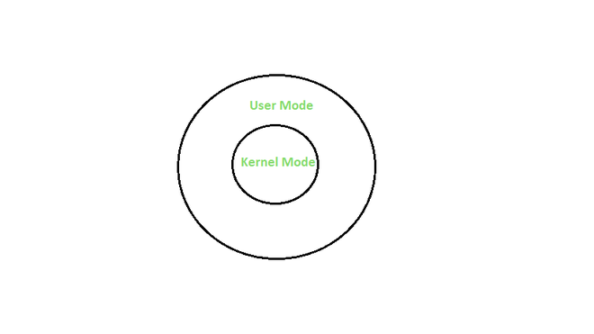

# Actividad 1  
#### Conceptos de Sistemas Operativos 
#### Facultad de Ingeniería  
#### Sistemas Operativos 1

#### Nombre y carnet 
- Yeinny Melissa Catalán de León    - 202004725  

Guatemala, Julio 2023.  
___
  
## Tipos de Kernel y sus diferencias  
___
Los kernel se pueden dividir en dos grupos: los esenciales y los no esenciales.  

### Esenciales  
__Kernel monolítico:__ es un Kernel que tiene un tamaño grande que tiene la capacidad de realizar todas las tareas. Gestiona la memoria y procesos, así como la comunicación entre los procesos y el soporte de las diferentes funciones de los drivers y el hardware. Algunos sistemas operativos que utilizan este tipo de Kernel son los Linux y Windows.  

__Microkernel:__ es un Kernel que está diseñado con un tamaño reducido, esto para evitar el colapso del sistema en caso de que falle.  Cuenta con diferentes módulos, Mach de OS X es el único que utiliza el microkernel.  

__Kernel híbrido:__ es una combinación de los Kernel mencionados anteriormente (monoítico y microkernel). Este es grande pero compacto que tiene la capacidad de ser modulado y otras partes de este mismo Kernel pueden cargarse de manera dinámica. Se utiliza en Linux y OS X.

### No Esenciales  
__Nanokernel:__ este Kernel es aun más pequeño que el microkernel. Está diseñado para sistemas embebidos ya que el nivel de confianza es mayor. 

__Exokernel:__ posee una estructura innovadora debido a que es vertical. Los nucleos son pequeños y su desarrollo tiene propósitos de investigación. En este tipo de Kernel la toma de decisiones está a cargo de los programas, para hacer uso delos recursos de hardware que brindan ciertas bibliotecas.  

__Unikernel:__ este tiene el propósito de eliminar capas intermedias entre el hardware y las aplicaciones, busca simplificar todo lo posible los procesos. Es el más normal en los dispositivos de bajo consumo.

__Anykernel:__ busca ser pequeño como un monolítico, pero también simplificar el desarrollo de los controladores, al mismo tiempo que ofrece mayor seguridad.

## User vs Kernel mode  
___
### User
Cuando se inicia un programa en un sistema operativo se inicia el programa con el modo de usuario. Cuando a este programa en modo de usuario se le solicita ejecutarse, el sistema operatvo crea un proceso y un espacio de direcciones virtules. Los programas que estan en este modo tienen menos privilegios. 

### Modo Kernel
El kernel es el programa central, del cual se basan todos los demás componentes del sistema operativo. Es el programa más priviligiado, a diferencia de otros programas y puede interactuar directamente con el hardware. Cuando los programas que se usan necesitan acceso al hardware primero deben pasar por el núcleo mediante una llamada al sistema y para cumplir estas solicitudes, la CPU debe cambiar de modo de usuario a modo kernel en el momento de la ejecución, Cuando se termina el proceso de ejecución se regresa a modo de usuario. 

  