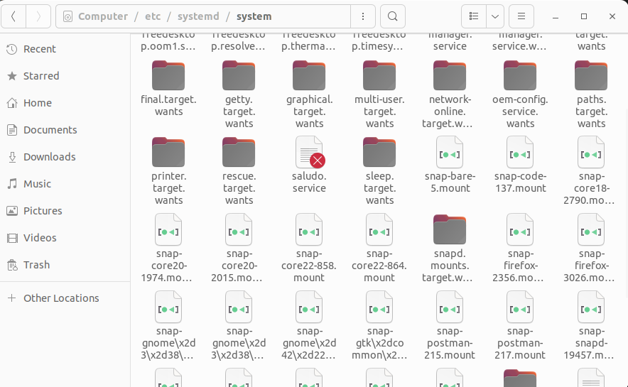
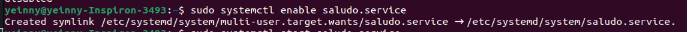
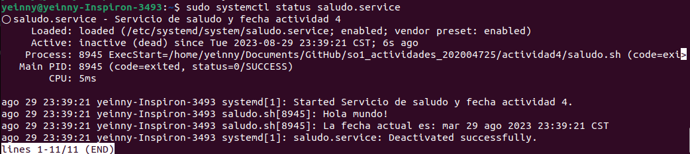

# Actividad 4  
#### Systemd unit  
#### Facultad de Ingeniería  
#### Sistemas Operativos 1

#### Nombre y carnet 
- Yeinny Melissa Catalán de León    - 202004725  

Guatemala, Agosto 2023.  
___  

## Proceso de instalación y uso del servicio
___

### Para poder usar el servicio se debe copiar o mover a la carpeta /etc/systemd/system/  

  

### Luego se debe activar el servicio por medio del siguiente comando  

<pre><code>sudo systemctl enable saludo.service
</code></pre>  

  

### Después se debe iniciar el servicio por medio del siguiente comando  

<pre><code>sudo systemctl start saludo.service
</code></pre>  

  

### LUego se puede verificar que todo esté bien con el servicio y ver la salida por medio del siguiente comando  

<pre><code>sudo systemctl status saludo.service
</code></pre>  

   

Como se puede ver en la imagen, se muestra el contenido que se desea imprimir. 

